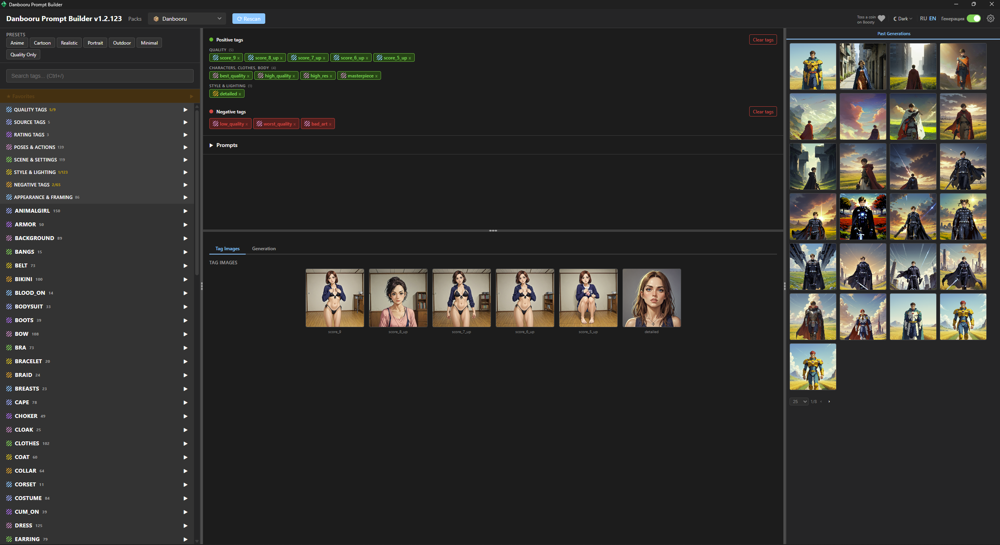

# Danbooru Prompt Builder

A prompt builder utility for AI image generation based on Danbooru tags.

**Note:** The application works with Danbooru tags and loads previews. Some tags and content may be NSFW (Not Safe For Work). Explicit images are blurred by default.

## Features

- **Tag Browser** — Browse tags by category, Favorite tags system.
- **Prompt Builder** — Field with selected tags, text representation.
- **Image Generation** - You can now generate images directly within the interface.
- **Image Previews** — Show tag preview images on hover and images generated within the app.
- **Generation and Prompt History** — Automatic saving of prompts via ComfyUI and loading them into the application interface.
- **Theme Switcher** — Light/Dark/Auto.
- **Localization** — English/Russian interface.



## How to Run
Download the latest release: https://github.com/DmitriusFalse/DPB/releases
Extract the archive.
Run DanbooruPromptBuilder.exe

### Tags Format
All tags are located in the `tags` folder, structure:

```text
tags/Danbooru/
  info.pack          — JSON metadata of the pack
  armor.txt          — one tag per line
  img/               — tag previews
    %tags_file_name%/ - Name of the file the tag comes from
      %tag_name%.png - Image named after the tag
```
`info.pack` — format:
```json
{
  "name": "Danbooru",
  "name_ru": "Данбору",
  "description": "Tags from Danbooru dataset",
  "categories": [
    { "name": "armor", "name_ru": "Броня", "file": "armor.txt", "block_id": 4 },
    { "name": "background", "name_ru": "Фон", "file": "background.txt", "block_id": 6 }
  ]
}
```
`name` - Tag category name in English
`name_ru` - Tag category name in Russian
`file` - file containing the list of category tags
`block_id` - (1–7), determines in which workspace block the tags will appear

Full `block_id` map (1–7):

| ID | EN | RU | Example |
|---|---|---|---|
| **1** | Quality | Качество | `quality` — `score_9`, `score_8_up`, ... |
| **2** | Sources | Источники | `sources` — `source_anime`, `source_cartoon`, ... |
| **3** | Rating | Рейтинг | `rating` — `rating_safe`, `rating_explicit`, ... |
| **4** | Characters, Clothes, Body | Персонажи, одежда, тело | `appearance` — everything from the pack (default `block_id`) |
| **5** | Pose & Action | Позы и действия | `pose` — `standing`, `sitting`, `lying_down`, ... |
| **6** | Scene & Setting | Сцена и настройки | `scene` — `indoors`, `bedroom`, `beach`, ... |
| **7** | Style & Lighting | Стиль и освещение | `style` — `natural_lighting`, `photorealistic`, ... |

## Build

```bash
go build -o main.exe .
```

Requires Go 1.26+. All static files are embedded into the binary via `//go:embed`.

## Tests

```bash
go test ./...
```

## Stack

- **Backend**: Go, net/http, SQLite (mattn/go-sqlite3)
- **Frontend**: Alpine.js, CSS custom properties (theming)
- **Database**: SQLite (WAL, foreign keys) — tables: packs, files, tags, favorite_tags, saved_prompts, tag_presets

## Support

If you found this application useful, you can toss a coin on [Boosty](https://boosty.to/sir.geronis/donate). It was made for fun, but any support warms the heart!

---

# Danbooru Prompt Builder

Утилита сборщик промптов для AI-генерации изображений на основе Danbooru-тегов.

**Примечание:** Приложение работает с Danbooru-тегами и загружает превью. Некоторые теги и контент могут быть NSFW (Not Safe For Work). Откровенные изображения по умолчанию размыты.

## Возможности

- **Браузер тегов** — Просмотр тегов по категориям, система Избранных тегов
- **Сборка промпта** — Поле с выбранными тегами, текстовое представление
- **Генерация изображений** - Теперь можно генерировать прямо внутри интерфейса
- **Превью изображений** — показ картинок тегов при наведении и картинок что были сгенерированы внутри
- **История генераций и промптов** — Автоматические сохранение промптов с помощь ComfyUI и загрузка их в интерфейс приложения.
- **Переключение темы** — светлая/тёмная/авто
- **Локализация** — русский/английский интерфейс


## Как запустить
Скачать последний релиз: https://github.com/DmitriusFalse/DPB/releases
Распаковать
Запустить DanbooruPromptBuilder.exe

### Формат тегов
Все теги лежат в папке tags, структура:

```text
tags/Danbooru/
  info.pack          — JSON-метаданные пака
  armor.txt          — один тег на строку
  img/               — превью для тегов
    %tags_file_name%/ - Имя файла откуда тег
      %tag_name%.png - Картинка с названием тега
```
info.pack — формат
```json
{
  "name": "Danbooru",
  "name_ru": "Данбору",
  "description": "Tags from Danbooru dataset",
  "categories": [
    { "name": "armor", "name_ru": "Броня", "file": "armor.txt", "block_id": 4 },
    { "name": "background", "name_ru": "Фон", "file": "background.txt", "block_id": 6 }
  ]
}
```
name - Имя категории тега на английском
name_ru - Имя категории на русском
file - файл со списком тегов категории
block_id - (1–7), определяет в каком блоке рабочей области появятся теги

Полная карта block_id (1–7):

| ID | EN | RU | Пример |
|---|---|---|---|
| **1** | Quality | Качество | `quality` — `score_9`, `score_8_up`, ... |
| **2** | Sources | Источники | `sources` — `source_anime`, `source_cartoon`, ... |
| **3** | Rating | Рейтинг | `rating` — `rating_safe`, `rating_explicit`, ... |
| **4** | Characters, Clothes, Body | Персонажи, одежда, тело | `appearance` — всё из пака (дефолтный `block_id`) |
| **5** | Pose & Action | Позы и действия | `pose` — `standing`, `sitting`, `lying_down`, ... |
| **6** | Scene & Setting | Сцена и настройки | `scene` — `indoors`, `bedroom`, `beach`, ... |
| **7** | Style & Lighting | Стиль и освещение | `style` — `natural_lighting`, `photorealistic`, ... |

## Сборка

```bash
go build -o main.exe .
```

Требуется Go 1.26+. Все статические файлы вшиваются в бинарник через `//go:embed`.

## Тесты

```bash
go test ./...
```

## Стек

- **Backend**: Go, net/http, SQLite (mattn/go-sqlite3)
- **Frontend**: Alpine.js, CSS custom properties (темизация)
- **База данных**: SQLite (WAL, foreign keys) — таблицы: packs, files, tags, favorite_tags, saved_prompts, tag_presets

## Поддержка

Если приложение оказалось полезным, можно подкинуть копейку на [Boosty](https://boosty.to/sir.geronis/donate). Оно сделано в удовольствие, но любая поддержка греет душу!
