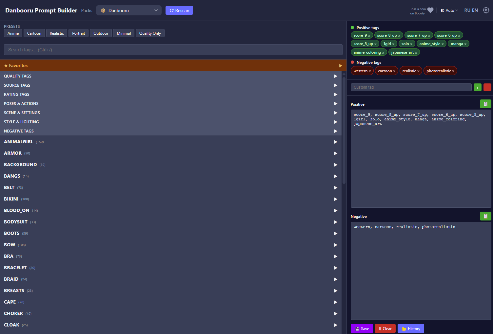
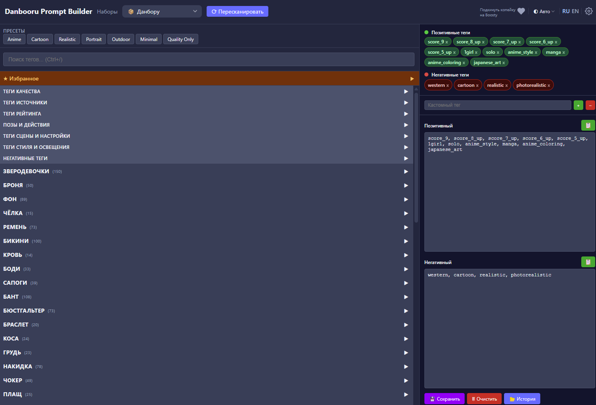

# Danbooru Prompt Builder

A Windows desktop application for building AI image generation prompts from Danbooru-style tag collections.

**Note:** This application works with Danbooru tags and fetches previews. Some tags and content may be NSFW (Not Safe For Work). Explicit images are blurred by default.

## Features

- **Tag browser** — search, category tree, favorites
- **Prompt builder** — add tags to positive/negative with `BREAK` grouping by category
- **Presets** — quick-apply tag sets (Anime, Cartoon, Realistic, etc.)
- **Image previews** — tag images on hover
- **History & favorites** — save/load prompts
- **Theme switching** — light/dark/auto
- **i18n** — Russian/English UI
- **System tray** — menu: Open, Packs Folder, Settings, Exit



## Usage

1. Place tag pack folders into `./tags/`. Each folder contains `.csv` or `.txt` files.
2. Run `main.exe` — a system tray icon appears.
3. Click "Open" or visit `http://127.0.0.1:8080` in your browser.
4. Select a pack, click "Rescan".
5. Search tags, add them to your prompt, copy the result.

### Tag Format

**CSV** — filename: `<id>_<category>_<subcategory>.csv` (e.g. `0_general_appearance.csv`). Content: CSV with columns `tag_name, category_name, subcategory_name, aliases`.

Category IDs: `0=general, 1=artist, 3=copyright, 4=character, 5=meta`.

**TXT** — one tag per line. Blank lines and `#` comments are ignored. Filename (without extension) becomes the category name.

## Configuration

```json
{
  "port": 8080,
  "tags_path": "./tags",
  "db_path": "./data.db"
}
```

Place `config.json` next to `main.exe`. Relative paths are resolved from the config file location.

## Build

```bash
go build -o main.exe .
```

Requires Go 1.26+. All static files are embedded into the binary via `//go:embed`.

## Tests

```bash
go test ./...
```

## Tech Stack

- **Backend**: Go, net/http, SQLite (mattn/go-sqlite3), systray
- **Frontend**: Alpine.js, CSS custom properties (theming)
- **Database**: SQLite (WAL, foreign keys) — tables: packs, files, tags, favorite_tags, saved_prompts, tag_presets

## Support

If you find this app useful, consider tossing a coin on [Boosty](https://boosty.to/sir.geronis/donate). It was built just for fun, and your support is appreciated!

---

# Danbooru Prompt Builder

Десктопное приложение для Windows — сборщик промптов для AI-генерации изображений на основе Danbooru-тегов.

**Примечание:** Приложение работает с Danbooru-тегами и загружает превью. Некоторые теги и контент могут быть NSFW (Not Safe For Work). Откровенные изображения по умолчанию размыты.

## Возможности

- **Браузер тегов** — поиск, дерево категорий, избранное
- **Сборка промпта** — перетаскивание тегов в позитив/негатив с группировкой по категориям через `BREAK`
- **Пресеты** — быстрая подстановка наборов тегов (Anime, Cartoon, Realistic и т.д.)
- **Превью изображений** — показ картинок тегов при наведении
- **История и избранное** — сохранение/загрузка промптов
- **Переключение темы** — светлая/тёмная/авто
- **Локализация** — русский/английский интерфейс
- **Системный трей** — меню: Открыть, Папка наборов, Настройки, Выход



## Использование

1. Положить папки с тегами (паки) в `./tags/`. Внутри каждой папки — `.csv` или `.txt` файлы.
2. Запустить `main.exe` — откроется системный трей.
3. Нажать «Открыть» или перейти в браузер на `http://127.0.0.1:8080`.
4. Выбрать пак, нажать «Пересканировать».
5. Искать теги, добавлять в промпт, копировать результат.

### Формат тегов

**CSV** — имя файла: `<id>_<категория>_<подкатегория>.csv` (например `0_general_appearance.csv`). Содержимое — CSV с колонками: `tag_name, category_name, subcategory_name, aliases`.

ID категорий: `0=general, 1=artist, 3=copyright, 4=character, 5=meta`.

**TXT** — один тег на строку. Пустые строки и `#` игнорируются. Имя файла (без расширения) становится категорией.

## Конфигурация

```json
{
  "port": 8080,
  "tags_path": "./tags",
  "db_path": "./data.db"
}
```

`config.json` кладётся рядом с `main.exe`. Относительные пути разрешаются от расположения конфига.

## Сборка

```bash
go build -o main.exe .
```

Требуется Go 1.26+. Все статические файлы вшиваются в бинарник через `//go:embed`.

## Тесты

```bash
go test ./...
```

## Стек

- **Backend**: Go, net/http, SQLite (mattn/go-sqlite3), systray
- **Frontend**: Alpine.js, CSS custom properties (темизация)
- **База данных**: SQLite (WAL, foreign keys) — таблицы: packs, files, tags, favorite_tags, saved_prompts, tag_presets

## Поддержка

Если приложение оказалось полезным, можно подкинуть копейку на [Boosty](https://boosty.to/sir.geronis/donate). Оно сделано в удовольствие, но любая поддержка греет душу!
